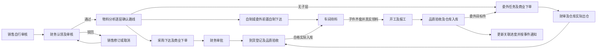

# 全平台本地审计与整改验收

2026-09-09 最新发布状态：公司已安装 `v2026.09.09-1`，数据库V540/499，HTTPS、办公网段、附件扫描及成套备份实际恢复验收完成。用户明确允许本次CI继续后台运行。当前现场事实以[公司内网手动发布验收](2026-09-09-公司内网手动发布验收.md)为准；下文“尚未部署”均为对应阶段历史记录。

日期：2026-09-08。本页是本轮当前状态与验证证据的统一入口。运营业务链优先，深入财务最后；任务范围见[全平台审计计划](../01-规划/2026-09-07-全平台业务链审计与整改计划.md)，执行顺序见[串行收口要求](2026-09-07-执行纠偏与串行收口.md)。专项报告只证明其明确的源码版本和场景，不能累加为最终全量。

## 2026-09-08 用户现场补充与 CI 结果

### 最新选仓与旧车间任务恢复（V540）

用户最新确认两项：禁用仓不能成为新的选择；合格子件已入库且分析已到齐时，已有车间任务也必须同步更新。实际分析 `5db34ee7-7fa7-43a2-9f7f-fd2a34a4778b` 的SJ15/V51043只差V51012的10,000件，该批已有合格专属库存。此前五金仓被停用，库存读取将其漏掉；后来启用也没有再次触发旧WAITING工单。这是读取范围与遗漏状态推进两处问题。

共享选仓已识别后端 `accountable` 字段，兼容旧别名；运营新选隐藏禁用仓、禁用祖先及不可记账叶仓，保留启用主仓导航与计划主仓选择。禁用的记忆默认值清空；历史名称保留显示，不重新加入可选菜单。后端新建/主动改仓及实际新入库重查可用状态，原来源固定的领料与反向继续保留原仓身份。

V540统一既有实物的主仓预算，加入有界自动齐套补偿：启动5秒后首次检查，此后每60秒最多25个候选，独立事务、有限查询/锁等待和游标轮转；正常入库即时触发继续保留。系统只推进已经批准且允许自动齐套的任务，完整来源、数量、预留与权限守卫仍在，不直接改SQL状态。唯一允许空人员的FORMALIZE须具备数据库系统标记、明确原因和有效任务/来源，审计显示真实系统动作，其它事件与人工入口仍要求真实用户。

当前真实用户V539数据库的独立副本在同版V540启动后，SJ15自动从WAITING恢复READY；4个等料变3个，其余确实尚缺自制子件。仍为7张计划、2张收货单，没有重复下单或入库。随后测试人员通过原领料链从原五金仓发出10,000件，重放没有重复扣减；再次补偿未新增审计或通知。另2条真实库存/退回链、3条调度测试与3类数据库伪造拒绝通过。原业务库不由该副本演练修改。

本批前端完整1,967项，1,966通过、1项因工作副本CRLF而触发源码换行断言；已按仓库LF规则保存该文件，原断言1/1复验通过，业务断言未变。全项目analyze零问题、1,226文件格式零变更。新后端同版全量在 `target-release-v540-final` 运行，较早V538全量与GitHub443dae0d暴露的4个失败已对应复验：SQL明确分隔符1项、附件真实登录会话5项及生产限流3项、主仓/车间原有契约24项。没有放宽生产登录限流或恢复逐子仓扣安全库存。

版本包继续使用阿里云OSS发布与下载更新；业务数据库、附件与业务备份使用公司内部服务器。当前仍为功能分支候选，待本次提交CI、完整本地结果、签名打包及公司手动激活，不将副本成功当成公司已经更新。

### 本地启动恢复与 V539

用户18:21的真实 `mvn spring-boot:run` 因 V537 checksum不一致失败：库中已执行值为 `-290329290`，后续修改的源码值为 `-2018214118`。已从首次创建记录找回原迁移，并用实际数据库函数源码独立复核同一校验值；恢复原V537，将暂存对象版本匹配及删除完成时间两处修正前向追加到V539。未执行repair，未改已应用历史行，也未重建或清空用户业务库。

修复前保存15,225,333字节备份（SHA256 `41755f508ac335c27b6b22984a7cf4882224f77a04071c3170ec74ed1d98e755`）。该备份隔离恢复后只应用V538/V539到539/498，361张非Flyway表全量行摘要不变。22项迁移、清库契约及真实PG前滚守卫回归全部通过，包括暂存版本不符、成功状态缺少完成时间时拒绝清空。

18:34实际只读核验用户已自行重启的后端：8080健康状态 `UP`，原V537记录及checksum保留，V538/V539均成功。没有启动第二份后端或停止用户进程。本次修复仍需最新提交CI；较早V538完整后端继续运行，其结果只证明冻结的V538运行资源，V539增量以上述实际副本和专项补验，不混写成同一次全量运行。

### 最新主仓口径与封版状态

2026-09-08 最新用户确认：计划部门只选择主仓并计算该主仓总量，仓库部门在实际领料单查看各子仓位置。历史单据的实际仓库 UUID 保留，显示名称通过真实父关系归到主仓；不会要求计划重新选择子仓或把合格到货红冲重做。

本地候选已增加 V538：公共安全库存按主仓、货品、颜色只扣一次，分析、下达、车间齐套、预留及真实领料采用同一预算。实际成本仍按原物理仓库分别记录。两个子仓 A30、B70，安全库存20、需求80的真实链已验证首次下达即齐套、分别领出30与50、重复请求不多扣；单价2与3时实领成本210，剩余20件价值60，按原领料事件退回后库存100件、价值270。79件不足、颜色和主仓隔离、并发抢同一预算、未经证明的专属标记及直接越额预留也已验证。

本轮 V536 完整后端曾运行3,844项，16失败、6错误、7条件跳过。已逐项修复真实业务问题及过时夹具并取得专项复验；不能把这次运行写成全绿。V537前端全量1,951项仅1项框内提示契约失败，已修复并通过该契约；其后主仓UI还有变动，V538正在做最终同版全量。最终结果与当前提交SHA在本节续记。

| 新增范围 | 已完成的本地证据 | 发布前剩余 |
|---|---|---|
| 委外与实际仓成本 | 核心真实PG19项及3条委外整链复验；POSITION_STORE原单退回、分批与非零成本已闭环 | 最终同版组合及公司安装 |
| 通知范围与速度 | 原126项范围证据保留；423账号/164超管样本从4,409次SQL降到4次，实际IQC投递最大1.29秒；未知旧结构降级10条真实事务验证 | 公司真实岗位与负载验收 |
| 内部附件入口 | 商业3类、财务5类、资产2类、货品、FQC、不合格处理、委外损耗共14类新增入口及原HR入口均接线，策略和UI专项通过 | 实际ClamAV、磁盘与服务器安装 |
| 附件清理与数据库 | V537实际HTTP清理18项；公司V476、用户V532副本升级V537，15,083结构对象一致、旧行保留、清空及恢复均通过 | V538最终增量演练 |
| 成套备份与监控 | 同快照数据库与原件备份、并发删除保护、失败与恢复真实PG9项；原子状态与监控组合19项 | 安装定时器并验证公司环境 |

源码封版提交为 `1516ad9a`；PR #17 的旧CI不代表新源码。V538完整Flutter共1,959项，其中1,957项通过、两条测试仍要求旧子仓设置。只修改这份测试以符合最新主仓请求，保留只读与失败恢复原UUID范围的保证，整文件7/7复验通过。Java1,600个主类与875个测试类同版编译通过，最终后端全量运行中。历史扫描仅命中两个新测试对象路径，逐行确认为随机文件名样例，按提交/文件/规则/行登记精确排除，不关闭规则。

随后核对该提交CI、签名打包、公司手动迁移和内网验收。实际公司服务器目前尚未更新；既有现金退款模块范围待决项继续单列，不冒充已交付。

当前证据目录为本地忽略的 `.codex-tmp/main-warehouse-safety-20260908/`、`.codex-tmp/release-v538-20260908/`；V537历史升级/恢复证据保留于 `.codex-tmp/release-v537-20260908/`。测试数据、备份与秘密不上传GitHub。

### 电脑崩溃后接续检查（历史阶段记录）

工作树及本地证据完整保留，已提交的远端版本仍为 `7df59c6b`；崩溃前未执行新的服务器更新。新增迁移目录当前为 V536/495。最终源码尚未冻结，不以旧提交或单项测试通过替代最新组合验收。

| 新增范围 | 当前明确证据 / 剩余事项 |
|---|---|
| 车间到料通知 | 126/126，其中真实 PostgreSQL 6 项；实际车间、主/兼职/负责人及当前动作权决定列表、数量、详情和弹卡，分页前过滤。旧计划齐套通知已退役。 |
| 采购申请分批下单 | 3 条真实 Spring/PostgreSQL 流程通过；申请人姓名、10−批准2−待财审3=可继续5、部分行与数量、重试、驳回、重提、批准、反审、负零回滚均覆盖。原明确超采设计保留，不将金额或数量裁小换通过。 |
| 实际仓与分析显示 | 两个其它主仓先到5再到5的真实入库→齐套→实际仓领料链通过；修复刷新中临时 active=false 导致来源漏算。显示的缺口、精确来源、入库去向和两仓数量一致。 |
| 到料查询开销 | 800份无关分析的真实PG5轮比较：当前候选查询中位4.355ms，原查询232.452ms；命中对象保持3项，读取块171对12561。受控样本观测，不承诺公司环境固定倍数。 |
| 委外多仓成本与原单撤回 | 非零核心已覆盖600→750→1000及原单恢复；最终真实委外链发现 POSITION_STORE 退回与核心 RETURN_ISSUE 退回的证明差异，正在修复，未标完成。 |
| 商业单据附件 | 销售、采购、委外3入口已接共享区；策略35/35、共享UI与直接调用方30/30通过。修复仅财审查看权借归属读取非待审附件的组合漏洞。 |
| 其它附件入口 | 5类财务单据、货品资料与FQC在实施；品质退回与资产相关入口仍需核对接线，不声称全覆盖。内部存储核心、真实原件往返与删除原专项保留。 |

当前发布前剩余：委外整链撤回、附件入口收口、最终全量与构建、V536实际备份前向/恢复及清库验证、文档核对；然后新提交 CI、签名打包、服务器手动更新及内网验收。现金退款模块的既有范围待决项仍见总计划。

新增专项证据：`.codex-tmp/workshop-notice-scope-20260908/result.json`、`purchase-request-partial-20260908/result.json`、`qualified-source-warehouse-20260908/wakeup-readmodel-integrated-r3.log`、`order-attachment-unit-r2.log`、`attachment-callers-r1.log`。上述短目录均位于本地 `.codex-tmp/`，不提交私有测试数据。

用户实际 V532 数据暴露“7 项下达后又出现 5 项待下达”的问题。现场只有 7 张计划，5 个已下达自制子件被重复投影为候选；真实关联、写入口剩余量与前端统一识别已修复，专项数据库、前端和用户备份隔离 HTTP 重复下达验证通过，见 [委外前置自制与下达去重核查](2026-09-08-委外前置自制与下达去重核查.md)。随后新增的实际仓库来源、委外多仓成本及通知范围仍在合并验收，不能将此前全量测试称作覆盖最新源码。

已上传提交 `7df59c6bda4bd2a5eb986384636a961054c841e3`，草稿 PR 为 #17。GitHub Flutter/Web、部署契约、密钥扫描、CodeQL 与依赖漏洞扫描通过；Quality Gate 后端运行 3,646 项、0 断言失败、2 执行错误、5 条件跳过。两错误来自测试引用本机 `.codex-tmp` 的 V517 草案文件，远端不存在该路径。已将 6 个相关测试类统一读取正式 classpath 迁移，在不含草案目录的工作位置复测 19/19 通过，保留原业务断言，未改已发布迁移字节。该修正尚需与本次业务修复一起提交并验证新提交 CI。

公司内部附件存储是用户追加范围，独立实现已合并到本地工作树；新入口与权限继续收口，尚未提交到 PR #17，也未安装到公司服务器。服务器容量只读核查完成，新附件实现不继承旧提交的测试通过状态。

## 最终V532索引增量与收口

V532只新增往来来源UUID索引，生产Java、查询和此前迁移不变。50万订单/发货/退货、100万往来记录的同一独立副本，8并发4,000次逐次核算均无错误；索引前后P99为194.519ms→30.045ms、吞吐79.05→652.60次/秒。执行计划从扫描50万来源记录转为按来源UUID定位，8张业务主表数量和摘要不变。这是受控服务查询对照，不是HTTP/写吞吐或生产固定倍数；原V508历史和V531对照分别保留，见[迁移130](../数据迁移/130-V532销售来源UUID查询索引.md)。

在V532/491重新通过相关契约、实际业务清空与旧导入结构检查，并通过双JAR包装检查，`backend-verify-v532-followup-r1.log`成功；前述完整套件及V531修正复验的事实保持原范围。实际服务器备份和全新来源各自保留V531副本后前向到V532，双侧导出/恢复对比15,019个结构对象，无缺失、额外或定义差异；主档与业务摘要不变，证据`server-v531-to-v532-rehearsal.json`。未写实际公司服务器。

现有源码、迁移、前端构建和本地证据已整理到功能分支；GitHub同一提交CI、签名发布和实际服务器激活另记完成状态。新增客户现金退款范围仍等待用户答复，不把可抵扣客户余额冒充已退款。

## V531本地完整套件与复验结果 (2026-09-08)

`server/target-operational-final-v531` 的完整 `UTEN_RUN_DB_TESTS=true mvn verify` 已执行3,658项：2项静态契约失败、0项执行错误、4项按条件跳过，耗时1小时11分。FullChain完整138条通过。两项失败分别是库存夹具写入从13处增至14处的固定计数，以及迁移索引已更新却仍断言旧V467横幅；逐条来源字段、旧导入目标V426/388及388行manifest守卫均保留。

随后修正为逐个夹具均有写入且每条具备来源，以及用共享目录头常量核对当前文档、单列旧导入器冻结目标。17项契约复验加2项双JAR包装集成检查通过，`mvn verify`续验成功。全量后的3,047份源码/资源逐文件核对证明：只有上述两份测试变动，生产Java与迁移字节完全一致。日志为 `.codex-tmp/operational-closure-20260907/backend-verify-final-v531-r1.log`、`backend-verify-final-contract-followup-r1.log`、`post-full-source-delta.json`。这是完整运行加明确修正复验，不表述为首次全量零失败。

最终前端包含待办徽标加载/失败状态与三语入口文案修正：1,872项完整测试、全项目静态分析零问题、1,212文件格式校验和release Web构建通过，日志 `flutter-*-final-v531*`，产物 `web-final-v531`。部署Python五组在Linux普通用户与root环境互补验证：849项，root的2项非特权跳过在普通用户运行中通过，所有部署Shell/Python语法检查通过；Windows缺少POSIX接口的初次结果保留，不修改安全守卫迁就平台。

当前Gitleaks8.29.1全历史扫描无命中；工作树16处均核为已有的确定性测试/协议样例，其中2处只是原测试行移动。当前Maven SBOM155项与Pub153项共308个依赖的OSV接口查询无已知命中。远端同一提交的Quality、CodeQL、OSV仍须独立通过，不能用本地结果代替。

此前全量失败已按最新规则逐组修复并取得专项证据：

| 范围 | 本轮结果与关键核对 |
|---|---|
| 到货、品质、实收及退回 | V531真实PG26/26；两行采购单完成一行仍未结案，另一行实际实收后才结案，保留100/60/30金额及实际来源。 |
| 收款、跨币、贷项与改单 | FullChain8项加UUID顺序真实PG1项，9/9；银行实际净额200→199、多单实际1400、0.00005原币和0.00035本币保留。 |
| 委外损耗、补料、减量和反向 | 5条损耗加2条改量，7/7；毛实发保留，商业目标不因损耗补料增加，正常损耗成本仅在财审新目标后重分配。 |
| 财务并发及预收汇总 | 两类12/12；实际到账输入明确，26个原金额预期保留，当前发货提交/财审来源完整。 |
| 历史销售退货 | 4/4；通过受控历史导入保留原额1/本币7、数量3和原始折扣。原出库成本缺失明确待核，退货待检不新增实物入库，不把NULL当免费。 |
| 其余金额及免费补偿 | 23/23，其中22项单元/契约及1项真实PG服务SQL；免费补偿要求两币种都明确为0，空值及极小非零拒绝。 |
| 实物变化唤醒物料分析 | 19/19；四类来源、反向和历史分支保留。800份无关分析、5轮等价查询结果一致，旧查询中位126.414ms、新查询2.275ms；维度扫描805→1次。这是受控样本，不承诺生产固定速度倍数。 |

专项日志位于 `.codex-tmp/operational-closure-20260907`、`finance-last-fixtures-v531`、`sales-return-history-v531`、`wakeup-candidate` 及 `server/target-money-unit-compat-v531/result.json`。旧失败完整记录保留，不以更改金额或关闭守卫换通过。

实际服务器备份的两份V529副本继续前向应用V530/V531，490迁移校验通过；升级与全新来源双侧结构导出/恢复后15,018对象无差异，业务及主档摘要保持，只有Flyway历史增加。证据 `.codex-tmp/platform-audit-20260907/server-v529-to-v531-rehearsal.json`。公司服务器未写入。

V531真实HTTP启动、登录及914入口烟测无5xx；清库应用函数、实际psql与旧导入结构共14项通过。原开发库另查为V516/475、订单/库存/ARAP主表为0；已完整备份并实际恢复到独立本地库。对原开发库启动新后端的动作被自动审批以 `blocked by policy` 拒绝，没有执行，原开发库仍未更新。另建的隔离UAT副本已正常启动V531，用于浏览器岗位验证，不能当作原开发库已修复安装。

最终Web已切到新的隔离UAT副本，资源哈希逐一匹配，API/数据库未重启。真实浏览器核验初审1/修改1、数量3→4对照；管理员打开修改审核详情时形成真实认领，销售唯一一次4→5请求被409拒绝，数量4/金额57.6/revision1保持；退出详情认领归0。无销售财审确认权的账号在前台观察95秒无审批弹窗，可只读查看修改明细，无确认/驳回按钮且不占用认领。证据位于 `.codex-tmp/platform-audit-20260907/uat-v531-20260908-061703-0e6b/`。该账号仍有少量其它业务动作权，不能称全局只读。

文档目录、前后端README共398份Markdown、2,333个本地链接通过；过期迁移/服务器/测试数字已从多个入口移到本页，旧临时启动方式从后端README移除。12个散落测试报告已按哈希移入本地证据目录，未混入上传范围。新增发布门禁在构建前、签名前各检查同一SHA的Quality/CodeQL/OSV最新运行成功；离线19项通过，尚未触发真实发布。

## 早期统一候选全量基线

2026-09-08已将当前源码和全部测试统一编译到`server/target-operational-closure-r2`，40.257秒通过；正式488个迁移至V529已保存独立校验快照。前端完整静态分析无问题，完整测试1,860/1,860通过，分别见`operational-closure-20260907/flutter-analyze-full-r2.log`、`flutter-test-full-r2.log`。过程中修正共用审核占用组件的目录归属、显式框内错误消息写法，以及3处测试类型/格式告警，未放宽架构或字段消息契约。

后端全量`mvn verify`本轮已执行完，3,639项、34项断言失败、82项错误、4项跳过，耗时1小时10分，日志`backend-verify-full-r1.log`，完整明细`backend-full-r1-result.json`。其中137条FullChain为124条通过、13条错误；不是最终整体验收通过。FullChain专项失败明细另保存在`fullchain-full-r1-failures.json`。已核验并整合独立验证的让料双端预锁/标量撤销、原ISSUE引用及后台任务隔离/测试生命周期13文件，上述修正已进入后续统一r4编译，运营专项结果见下方。运营预锁、直接委外准备入口、货品单位约束及真实出仓前提已复验；实际银行金额新输入、贷项分摊和抵扣反向等按财务后置顺序处理。

真实公司服务器备份的独立本地副本，从V476/438完整前向迁移到V529/488，50迁移与校验通过；客户260、供应商386、员工143、货品138、BOM217、部门40、仓库6和用户6的主档摘要保持一致(货品只排除此前已明确审查的单位锁与更新时间元数据)。原始V476恢复库保留，实际公司服务器未写入。

将升级副本与全新建库都经过PostgreSQL16的结构导出/恢复后，14,997个父级目录对象无缺失、额外或定义差异。初次14处差异是新增对象的数组类型转换及UNION分支显示别名，已用双侧实际导出/恢复验证等价，没有新增迁移去改写这些等价表达。证据`platform-audit-20260907/server-v476-to-v529-rehearsal.json`、`server-v529-schema-roundtrip-comparison.json`。角色所有者/授权、动态分区子表、序列当前位置和数据内容仍另行验收，不能由结构相同代替。

## V530及运营修正的补充结果

V530补齐新业务事实审计，已知V503旧触发器形状前向修复，保留旧数据、原审计和合法既有触发器；未知异形继续拒绝，专项29项通过，见[迁移129](../数据迁移/129-V530业务审计覆盖与稳定对象来源.md)。无新增业务表。统一r4源码/测试编译通过57.736秒；V530/489下清库脚本、实际数据库函数与旧导入SQL结构兼容共14项通过，日志`reset-bootstrap-v530-r1.log`，不代表真实YTDQ业务数据已迁入公司服务器。

本轮运营选择122条真实FullChain复验，121条通过，唯一错误在`directCustomerShipment_partialReceiptsAndOrderedReversalsUseShipWithoutInventedOrder`的后续收款旧输入缺实际到账金额，按财务顺序处理；记录`operational-fullchains-r3.log`及`operational-r3-result.xml`。没有把该有收款步骤的失败改成通过或从总记录抹去。

最新归口契约验证：权限/分析/退役出货74项通过，库存锁/原子领料/批量点收17项通过，到货输入/品质实收/历史快照26项通过，销售阶段金额权限9项通过。库存锁测试改为模拟Spring全部同步器的暂停/恢复/提交，真实业务锁未放宽；退役其它出货仍明确拒绝创建/编辑/删除/旧审核，历史源UUID和快照读取保留。已有真实归一化与重复单据拒绝测试保留，不再靠旧空白格式或退役私有方法名判业务。

V531仅修正审计备用身份读取时误含主键INCLUDE列的问题，现有受审表无此形状；单列、复合主键的真实I/U/D审计及既有覆盖验证31/31通过。正式目录现在为V531/490，V530原字节保留，无新增业务表；清库允许目录和统一验证支持已同步。此前14项清库结果仍只代表V530，V531的清库及服务器备份副本复验另行记录。

供应商抵销撤回发现真实JDBC日期类型转换错误，`SupplierOpenItemOffsetService`改用统一日期读取器，非有限资金份额贷项往返及SQL契约2/2通过，日志`operational-closure-20260907/offset-date-r1.log`。没有修改实际金额、分摊或舍入规则。

## 已完成运营修正的场景与证据

早期第二组24条运营边界曾22条通过、2条报错，日志`operational-closure-20260907/operations-boundaries-r1.log`。覆盖非线性BOM/固定批次、WAITING开工条件、跨仓领料、委外前置子件、分批完工和入库反向等。不能将这些数量与以前轮次叠加为全项目通过。

- 公共在途采用：新采用行动会引用原采购申请或委外申请，初次预锁未包含该来源，写完后刷新分析被来源守卫拒绝。`ProductionMutationFootprintService.forSharedFutureClaim`现在提前发现同仓同物料的可采用商业来源，再遵循商业来源→库存→分析的锁顺序。守卫保留，不在回调中补拿上游锁。两条真实全链和两条锁范围PostgreSQL回归共4项通过；其中需求500、公共1500、另一分析采用1000后实到800，仍准确保留原需求500、第二分析实物300/在途700、未认领公共500。日志`public-claim-r1.log`。
- 普通采购收货撤回：V527专项4/4通过，69.28秒，覆盖全部、仅入库5/10、分批3+7、已经发货时整次拒绝且不留半笔记录。日志`server/target-purchase-reverse-fullchain-r2.log`。V527最终SHA为`1A253ACE575BEF41277F6DAC48F22168DD43634DDE1176EB5A333597FE45867D`，该迁移已进入后续统一候选。
- 委外收货撤回：V528已修正并在独立完整Spring/PostgreSQL中4/4通过(487迁移，82.21秒)。包括原正常链、非零400分离归位为原库存120/自有材料80/加工费200、实际发货后整次拒绝，以及普通采购回归；日志`server/target-subcontract-reverse-r4.log`。已有正常损耗投入、跨补回代际和后续使用仍有明确限制，不能据此称复杂反向矩阵已完成。
- 到货登记入口：单张和批量页新增“到货来源”，可自动识别、明确正常到货或先补退货。选择随明细和幂等请求提交，避免两种待收来源并存却没有可操作入口。页面10项通过，5个相关文件分析无问题，日志`arrival-source-tests-r4.log`、`arrival-source-analyze-r3.log`，并验证原页重试与新批相同数量分别识别。现行设计和代码函数见[仓库到货登记页](../03-页面/仓库到货登记页.md)。
- 并发与权限：26/26真实全链通过，110.9秒，日志`concurrency-permissions-r1.log`。覆盖重复财审、财审认领与改单互斥、重复IQC入库、竞争同一库存、生产入库与销售改量双向等待、品质并发、采购/生产/仓库对象范围、提权及部分退补数量边界。
- 直接委外草稿：原缺少接线已补齐。2026-09-08核实R4的15文件SHA全部匹配，V529冻结SHA为 `F2E40E0BF6F2B18C73E0711A5B4A444248CF67369AC5CF3575ECF2AB33D79AF6`；488迁移完整Spring/PostgreSQL真实多岗位5/5，79.31s，工作台查询6/6，8.001s，证据 `.codex-tmp/purchase-reverse-closure/direct-preparation-r4-{fullchain,workbench}.{txt,xml}` 和 `direct-preparation-r4-source-hashes.json`。SC-ORDER真实FK/冻结基本量、原SC-PREP兼容、精确计划部门范围、同货共池、财审前生产与送审/批准库存重核、实际出仓预留均有专项覆盖。前端warehouseId/实际叶仓、DRAFT_PREPARATION三状态与OPEN_ANALYSIS真实summary入口14项通过，日志 `.codex-tmp/operational-closure-20260907/subcontract-preparation-ui-r1.log`。现有分析来源仍独立回归；具体合同见[128](../数据迁移/128-V529直接委外草稿准备.md)，这些专项不是最终全项目整合或岗位浏览器验收。
- 业务清库：22张新增业务表已显式登记，当前266 CLEAR/96 PRESERVE。`.codex-tmp/operational-closure-20260907/reset-contract-r4.log` 11项通过，含真实psql/独立PostgreSQL清空；该次486迁移至V527。较新V530清库与导入结构14项结果见上方；该早期11项不能扩写为其它版本结果。

文档整理已重写README与续作导航、合并并删除10份重复交接原件，稳定专题、README及续作导航的172处本地链接通过。清理原件校验和合并映射保存在`.codex-tmp/docs-consolidation-20260907`；销售/委外SOP由649行收敛为245行，79处本地链接通过；生产04主文拆成现行主流程、计量来源与品质反向专题，总计1,927行收敛为341行，72处本地链接通过。仓库到货页也已整体去除旧覆盖段。源码、已应用迁移和独有验证证据不因文档精简而删除。

## 发布前仍需完成

- 剩余业务及财务失败分组修复后，冻结同一源码/迁移组合，再跑最终全量；已有专项和早期全量数字不能相加。
- 当前组合的实际HTTP启动、岗位浏览器操作、通知延迟与最终规模压力；V527的健康/登录/914入口烟测仅作为早期范围证据。
- 最新服务器备份副本前向升级、结构与数据核对，以及发布前新备份、实际服务器权限/配置检查。
- 按用户授权提交GitHub并完成CI、签名打包上传，再手动更新公司服务器和执行经验证的业务清空；本轮尚未执行这些动作。

财务后置未闭环范围仍包括历史资金核对、普通退货共同账面分配、复杂贷项/损耗、客户退款与供应商索赔兑现、后补成本与GL和资产口径。具体清单见全平台计划及专题，不因文档精简删除。

本页日志若仅写文件名，默认位于 `.codex-tmp/platform-audit-20260907/`；其它目录显式标注。日志为本地忽略文件，未随文档上传。

## 业务规则与修复范围

| 范围 | 本轮查到的问题和修复方向 | 验证要求 |
| --- | --- | --- |
| 销售财审 | 审核占用与销售写入互斥；未开始审核可编辑；批准后受控修改进入独立修改复核队列，前后商业快照保留 | 单笔/批量版本冲突不写入，驳回可修订/取消，实际下游事实不重写 |
| 采购/委外财审 | 已批准改量复核的驳回误用草稿状态校验；商业快照序列化与比对不统一 | 正确批准/驳回、过期快照拒绝、已生效业务不重复执行 |
| 物料/委外主链 | 顶层委外子树被隐藏、直属物料匹配错误、前置自制已领用覆盖消失导致重复需求 | 顶层/中层/叶委外，先下达待料任务，实际齐套后领料开工，质检入库后接后续委外 |
| 委外分批及反向 | 通知操作人权限混用、固定批次代际、重复请求鉴权、通知批次不能冲销、拆分恢复预留重复扣产出 | 同任务/跨任务并发、重放、下游未解除拒绝、追加式全批冲销及实物反向 |
| 销售退货 | 退回金额采用客户端输入、来源币种/汇率权威不足；退货纠错漏扣全局预留 | 原发货和应收快照计算、分批尾差、重复与并发、纠错不得侵占其他订单承诺 |
| 权限/通知 | 收件台退役；弹窗缺真实业务落点；查看权限被当操作权；调岗/收权/换身份后旧提醒仍可显示 | 页面/动作/对象范围、实时部门与动作权、身份代际、初审/修改徽章互斥 |
| 默认值/学习 | 部分字段只有黄框无图标；仓库来源放在框下；光标变化误判人工编辑；迟到默认覆盖新选择 | 黄框/浅黄底/框内图标、触屏/键盘、手改状态随行、历史快照不冒充学习值 |
| 通用数据读取 | 字典失败永久缓存、嵌入到货来源切换未刷新、迟到列表/计数回写 | 故障恢复可重试、同请求合并、按会话和请求代际隔离 |
| 个人列表 | 模拟身份切换后工资条/我的报销仍显示前一身份数据，手动刷新可能覆盖新筛选 | 切换身份清空旧列表，框架管理的查询代际丢弃旧响应 |
| 访客 | 审批缺锁可覆盖已签到终态；短码没有同等有效期，拉黑后旧凭证仍可使用 | 并发审批/签到终态保护，扫码/短码/直接签到统一校验 |
| 分页协议 | 查询限制每页最多 100，但响应仍回传原始超大 size/非法 page | 35 个列表服务改用实际 Page 的页码、大小和总页数 |
| 委外任务规模 | 前置任务另取第一页并在前端计数，超过 100 条漏列表/徽章 | 未完成前置任务与正式申请/订单在服务端统一过滤、计数、分页；单任务按 UUID 读取详情 |

已进入物料分析、排产、实发、预收或应收的订单不能用整单覆盖来改写已有事实。安全的专用改量、退回及反向通道继续执行来源、数量、金额守恒；这不等于批准后可以无限制改写历史。

图中的“下达”只产生明确任务和来源关系，不代表已经领料或已经入库。部分数量、不合格、退回和冲销由原任务及其追加事实账继续跟踪，禁止新建第二份子件责任来代替原链路。

## 迁移与旧数据的阶段证据

早期 V499 阶段包含 V492–V499，当时目录 V499/461。V497 增加待处理任务的部分索引；V498 添加货品基本单位的使用后锁定标记与来源守卫，10 项真实 PG 用例及实际主档克隆升级已通过；V499 修复已结案订单绑定预收的合法历史反向。后三者不增加业务表。新表 `sales_order_revision_logs` 与 `preplan_subcontract_make_batch_reversals` 均为追加事实，纳入行级审计及系统测试清空策略。运维脚本与应用内清空函数保持同表分类，当时业务表总数 326，其中 CLEAR 230、PRESERVE 96；当前分类和计数只以迁移总索引及正式迁移校验为准。

旧迁移不改字节，不使用 `flyway repair`。历史财务确认版本以默认版本初始化，既有确认与金额事实保留；旧界面深链兼容跳转。具体前向数据规则见[迁移总索引](../数据迁移/README.md)。

## 性能与响应

- 采购/委外商业默认值按 100 个货品分批、最多 2 个请求并行；返回值只应用到仍有效的原行和当前身份，不覆盖人工填写。
- 委外通知守恒只检查本次影响的任务，保留全量审计函数；不再每修改一个任务扫描所有任务批次。
- 公共字典按字典分别缓存成功结果、合并正在进行的请求，失败后允许重新读取；单张失败不丢弃其它成功字典，强制刷新也不会被更早结果覆盖。
- 现有大表分页/虚拟化、根工作台聚合等原有重构保留，最终全库测试验证兼容。本报告不以静态代码代替目标规模 P95/P99 性能实测。

进度查询也修正为“申请明细 → 所有订货明细 → 实际收货明细 UUID → 对应 IQC”。同一来源多次订货不能被单值 Map 覆盖，订货项 UUID 不能冒充收货项 UUID。部分合格待入库显示等待入库，仍有实物缺口显示等待到货/回厂；旧零需求转出行按每个订单的实际基础数量分别证明完成，不能以一个订单超收掩盖另一订单未到。

## 前期基线验证记录

验收日志位于本地忽略目录 `.codex-tmp/platform-audit-20260907/` 及各独立 Maven 输出目录，日志未上传。

| 检查 | 对应阶段记录 |
| --- | --- |
| 最终 Flutter 全量格式/analyze/test/Web release | 待最终冻结后执行 |
| 最终 Maven verify，显式开启数据库测试 | 待最终冻结后执行 |
| 迁移及关键真实 PostgreSQL 链路 | 各专项已执行，最终组合待复核 |
| 版本锁定字体 | 729 项通过 |
| 部署模板与脚本语法 | 模板通过，Linux bash/Python 语法扫描无错误 |
| Linux 部署工具契约 | 5 组共 942 项通过；其中主运行因普通用户条件跳过的 2 项，已在独立普通用户容器补验通过 |
| 依赖已知漏洞 | 当前后端 SBOM 与 Dart lockfile 共 308 个包版本，OSV 查询无匹配 |
| Git 历史密钥扫描 | Gitleaks 8.29.1 扫描 317 个提交后通过 |
| 当前源码密钥扫描 | 16 项命中均与已有明确审核过的测试夹具逐行相同，无新增未解释项 |

基线结果不冒充最终结果：首次普通 Maven 测试 3315 项，458 项跳过，其中 456 项需要显式 `UTEN_RUN_DB_TESTS=true`；其 7 个失败属于并发开发中的旧源契约与新增结构同步检查，必须在冻结后的完整运行中重新验证。首次 Flutter 1751 项通过，1 个路由文件加载在新增页面参数尚未接入时失败；最终重跑不得沿用该结果宣称全绿。

历史扫描新增的唯一精确排除为提交 `abed98f4ac0a70e5d9d1dec927388b9c5791e2a1` 中 `deploy/release/offline_release.py:1350` 的 `generic-api-key` 命中。核验该语句调用 `regular_file(args.private_key, ...)`，匹配的是固定描述字符串，实际密钥通过文件参数读取。仅登记该提交/路径/规则/行号，不屏蔽整个文件或私钥规则。

OSV 查询使用[官方批量接口](https://google.github.io/osv.dev/post-v1-querybatch/)，仅发送公共依赖名和版本。零匹配表示查询时数据库无已知命中，不能证明不存在未知漏洞。

## 交付边界

本报告记录本地源码与自动化验收，不表示当前运行服务已安装新代码。现有业务库升级、真实岗位实物验收、历史数据最终对账和部署均未执行。没有上传、提交或发布动作。

## 克隆、前端及问题发现的早期证据

- 最近完整 Flutter 1786 项、analyze、格式及 Web release 通过；晚于该次运行的财务精简、资金卡、IQC 单位和 V498 前端不能沿用它冒充最终通过。
- 本地 V491 数据库只读导出的 13,539,241 字节备份已实际恢复到独立 PostGIS 容器和数据卷。真实主档为货品 138、员工 143、客户 260、供应商 386、部门 40、仓库 6；BOM 217 行，其中 201 行有效。销售/库存/应收业务表为空，后续使用真实主档与合成业务场景，不宣称历史财务验证。
- 非零资金链曾发现“先用预收抵扣，再收款”本币余额漏减已抵扣金额；后续实际金额/银行专项及仍未闭环的范围统一见[财务验收交接](2026-09-07-V519-V520-V523财务实际金额与银行链验收交接.md)。
- 车间材料使用曾缺对象写范围和普通车间入口；需要管理写/本车间分段写分界及跨对象拒绝证据，现有固定16链仅覆盖其明确列出的权限场景。
- 财务新建表单已减少单号/制单人等重复字段，将无手续费和备注等偶发内容收起；关键账户、金额、经办和必要凭证保留。专项布局/交互测试通过，完整浏览器走查待完成。
- 早期库存出库、销售成本和生产WIP未形成一致链，现已接入实际来源并有非零正反向专项，见[库存实际成本接线与验收](库存实际成本接线与验收.md)。这不替代全部GL和后补费用场景。
- 多产品/深层BOM和资金压力已分别建立专项夹具；最终P95/P99仍须在候选冻结、无并行编译干扰时采集，当前没有全平台压力通过结论。
- ADR-048 尚未交付实际客户退款。当前退货贷项和待处理客户余额不会显示为已退款，此项仍列为总范围未完成工作。

## 基础全量 R2 及浏览器实际链路

后端 R2 在独立 `target-platform-final-r2-20260907` 显式开启数据库测试，完整运行 1 小时 35 分钟：3418 项，10 个失败、2 个错误、1 项跳过。该次编译资源止于 V497，运行期间源文件继续修改，因此不能作为最后候选验收。数量阶段上下界错误、未实际开工的旧生产夹具、通知操作权夹具、旧采购快照源契约、预收历史来源文案契约、迁移头/数量常量、退役权限面、委外容量/来源守卫及清空脚本版本契约已分别修正。这些修正和后续严格财审认领必须由最终同版本全量重新验证。

唯一跳过的是要求 V238–V288 且有真实历史付款的独立回放。本次 V491 主档克隆业务账为空，不能把它冒充该历史付款测试，也未修改回放前置条件强行通过。

浏览器实际使用独立普通财务岗位，后台业务使用独立普通销售岗位；两个都不是超管。克隆应用只连内部 Docker 网络，短信、外部 AI、附件上传和外部存储服务关闭。测试代理仅发布到 `127.0.0.1:18085`，原用户账号在克隆内停用，测试通知不会发送到原系统。

| 实际步骤 | 结果 |
|---|---|
| 普通财务登录→工作台→钱流管理→新建销售收款 | 正常；收件台入口已删除，无费用不展开三项费用字段，费用说明图标可点击展开 |
| 普通销售用真实两产品建立隔离订单并自行审核 | 2×90+3×81=423，未建立正式本币应收；财务待审 1 笔 |
| 财务收到居中弹窗→进入订单财审详情 | 进入正确任务页，显示 2 个产品、数量/单价/金额和销售负责人 |
| 财务保持审核详情打开，销售尝试改第一项数量 | 服务端 409，明确告知对应财务正在审核；两行事实和金额 423 均不变 |
| 财务在实际页面确认通过 | 持久化 `finance_confirmed=true`，确认员工为 `AUDIT-finance`；原 UI 输入的选填备注未形成已验证证据，不纳入通过结论 |
| 审核结束后销售将第一项 2 改为 4 | 总额 423→603，明细 UUID 保持，财审版本变为 1 并重新待审 |
| 新提醒→独立“销售订单修改”队列→修改审核 | 显示 1 次变更，原数量 2→4、原行金额 180→360、订单合计 423→603，并显示修改人和时间 |

该实走发现旧认领失败会放行UI、采购/委外决策缺本人有效租约原子校验。实现和失败场景证据见[财务审核租约与订单互斥](2026-09-07-财务审核租约与订单互斥.md)；上述历史正常路径不能代替最终候选回归。

## R4 前端、通知和独占性能的阶段证据

- R4前端全量：1,828 项通过，全项目 analyze 零问题，Web release 构建通过。日志 `frontend-r4-*.log`；仍不代表 V500 及后续成本页面的最终组合验收。
- 严格财审 UI 47 项通过，四种财审入口支持认领失败只读/重试、续期失败停用、提交携原 claimId/业务版本，以及修改队列正确返回；后端及最终组合范围仍以对应专项与本页当前状态为准。
- 通知前端 37 项通过：前台每 2 秒检查；同批状态请求按 50 条合并；暂时失败重新排队，不假记已送达；居中待办不等慢的旧公告分页；旧身份/旧代际响应不能弹窗或确认新会话已送达。登录检查 300ms 起步并有有界重试。
- Outbox 提交后异步唤醒、满 20 条续批、并发唤醒合并、原退避及停机后恢复，组合 23 项和最终停机专项 1 项通过。应用事务提交前不会投递，回滚不唤醒。
- 十万订单/发货/退货各一份，8 并发、2,000 次每次校验的资金汇总服务查询：0 错，4.894 秒，P50 18.31ms、P95 25.90ms、P99 44.93ms，408.64 次/秒。测试等待显式本地计时门后，确认其它编译/测试已结束才开始；不含 HTTP 或业务写吞吐。
- 建数阶段同时发现全局编号保护的排序规则索引不匹配；V501 只加匹配索引，非空历史与唯一约束测试通过。该压力运行在 V499 加 V501 同源索引的诊断库，完整新候选仍须正规回放；最初未开始计时的巨型 INSERT 已取消，不能计入通过结果。

## 公司服务器只读基线

以下是本轮取证时的快照，不能用来推断之后服务器当前版本；正式操作前仍需重新核实。

本次已通过既有 SSH 主机密钥严格匹配连接 `utenelec-imp-server`。实际运行版本为 `v2026.09.05-1`、数据库 V476/438；应用、Nginx、PostgreSQL、updater 和备份定时器均 active。438 个已应用版本与当前本地已验证来源的脚本名/校验值逐项一致，未发现已应用迁移字节冲突。版本一致不等于实际结构无手改，仍需恢复副本及 schema 对比。

主档计数与本地相同：货品138、员工143、账号6、客户260、供应商386；销售订单、库存余额/流水、AR/AP 和物料分析主表当前均为0，不能据此宣称全部业务表已清空。服务器当前 PGP 主密钥版本2并有旧版兼容，不能为“与本地一致”覆盖成开发密钥。

已只读导出服务器一致性备份到本机受限目录，11,382,159 字节，SHA256 `5dabee627869d4651e5449dbf4bdfd8a787030f8773cb030725533a6b661ee54`。备份已实际恢复到独立本地容器，核对 V476/438、货品138、员工143、账号6及销售订单0；原始恢复库保留不变，供完整候选前向演练。未在服务器执行迁移、清库或应用切换。后续切换前仍需新的事前备份，不能用本轮较早的快照替代。

### 实际结构对比与 V505 候选

在相同 PostgreSQL 16 中重新执行 V476 的438个迁移，再将所得结构同样导出并恢复，排除 `pg_dump` 对数组类型转换和视图列别名的等价重写；仅统一函数源码 CRLF/LF。对比12,883个基线对象后，实际差异为：8个历史追加账触发器应为 `ALWAYS` 却为普通 `ENABLE`；归档审计缺少3个筛选索引；新库残留一个按 V183 以后规则应排除的编号计数器审计触发器；销售其它出货的3个成本分项默认值为0而服务器为NULL。触发器状态已再次远程只读核验，非恢复过程制造。

V505 前向候选恢复8个已知触发器模式、明确补齐3个索引、移除已识别的冗余计数器审计触发器，并统一成本分项不默认填0。它不修改任何历史成本字段值、业务事实或审计行；遇到同名但不同定义的触发器/索引拒绝执行。

独立副本已经执行该候选：收敛后12,882个对象无缺失、无额外、无定义差异；321张父表完整行摘要前后相同；合法种子账本在 `session_replication_role=replica` 下尝试修改也被SQLSTATE55000拒绝。证据为 `server-v505-schema-convergence-proof.json` 和对应日志。随后 V504/V505 已进入正式源码目录，清空策略/实际非空清空/结构修正及异常对象拒绝共12项通过，日志 `reset-schema-convergence-r1.log`。比较不包括恢复时有意省略的原服务器所有者/授权、动态审计分区子表、序列当前位置及物化视图内容，最终部署检查需另行核对。

### 实际服务器来源 V476→V505 前向演练

从保留的原始 V476 恢复库再创建独立副本，实际执行477至505共29个迁移，历史记录变为467条并通过Flyway校验。货品、BOM、员工、账号、客户、供应商、部门、仓库的完整内容摘要不变；货品只排除本次明确增加的数量单位锁和对应更新时间/操作者元数据。

321张原父表中仅9张按已读迁移规则发生变化：审计日志、授权代际、部门权限、Flyway历史、货品单位锁、权限面及其关联、权限目录、车间负责人偏好。其它原表摘要不变；新增16张事实/价值表。证据为 `server-v476-to-v505-rehearsal.json`、对应日志及出口0。原始恢复库和远端均未改动。这是实际来源到V505的演练，不能覆盖仍在实施的V506及以后成本/退货容量迁移，也不能代替有历史财务业务数据的独立回放。

### 履约锁顺序组合进度

仓库和分析相关98项专项已通过，其中2项实际Hibernate/PostgreSQL验证来源发现的仓库/颜色边界、当前BOM、变动指纹，以及新增锁定的子料不会继续扩张到无关分析。该次之后继续处理相同幂等请求等锁重放：已提交且内容一致的不可变命令可只读返回，未命中重放才在首次写入前核验来源指纹。不同操作造成的源变化仍需拒绝整笔写入。

新的销售改单与成品点收真实双向竞态已通过：一侧先完成，另一侧在真实PG锁等待后要么使用一致来源提交，要么409且本次无部分事实，刷新后可提交。核对订货12、生产10、实物10、预留10、计划及分摊入库10和单次确认；其场景采用无分析的独立计划，不代表“已有物料分析后改单待财审”分支通过。该段只解释当时独立计划的竞态证据；已有物料分析后改单待财审的实际到货路径已纳入本页最新16链。

## 持久化压力与其他独立阶段证据

50万单旧压测R1因30分钟独占计时门超时，没有测速结果，不能计通过。新的持久化夹具每500行与完成标记同事务提交，连接前核对专用库身份，仅监听本机；100单首次准备及重启续跑各1项通过，日志 `pressure-resume-smoke-r1/r2.log`。50万单主动首批中断保留500单/1批次标记/1夹具，报 `INTENTIONAL_PRESSURE_PREPARATION_INTERRUPTION`，随后 `pressure-500k-durable-preparation-r2.log` 续建完成。

最终独占基线为订单/发货/退货各50万、100万往来记录，8并发、4,000次逐次校验的服务查询，0错；P50 52.2459ms、P95 81.0547ms、P99 89.2086ms、138.49次/秒。证据 `sales-money-pressure-500000.json`、`sales-money-pressure-500k-baseline-r2.log`。该基线只对应V508/470，不含HTTP和写吞吐；当前新候选仍需复测。

V513双币结清5项通过，要求两币余额均0才结清，缺原币的历史记录保留旧形状。V514真实DRAW/WDRAW与反向2项、底层PG夹具8项通过，日志 `dual-currency-settlement-r4.log`、`production-material-movement-link-r2.log`、`production-material-movement-fixtures-r1.log`。各自是对应阶段专项。

历史重复计款更正原型的8项单测 `billing-correction-plan-r1.log` 采用四位分配和自动尾差损益，已被实际单据/银行金额规则替代并撤出运行路径；不再作为当前财务验收。不得恢复自动软件余数FX/LOSS。

## 启动故障记录与已完成的接续

2026-09-07 12:08–12:09 的 `server/logs/uten-imp-dev.log` 依次报告缺 `finance_receipt_lines.bank_basis_after_local`、缺 `purchase_receipt_items.replacement_intent`、缺 `ProcurementInventoryValuePort` bean。后续阶段还暴露正式资源缺付款字段。不能用编译通过掩盖这些真实启动失败。

财务顺延后的首轮日志 `finance-cost-forward-renumber-r1.log` 及 `receipt-v2-unit-r1.log` 仍保留，其中旧收款34项有5失败2错误，只标识当时断点；当前专项结果见财务验收交接，不将旧失败或旧V1断言直接推为现版本结论。

当时只读核实本地开发库已应用V508、V511、V513–V516，V515/V516为另一次启动修补，保留原字节：

| 已应用文件 | SHA256 | Flyway checksum |
|---|---|---|
| V515__finance_receipt_line_bank_book_balance_columns.sql | `EC7F5B4480F6525716F20378086DE30C9058970BD0E74761E86BC197CE3319A8` | 818004378 |
| V516__purchase_subcontract_replacement_intent_columns.sql | `A7EA80C2CDA6264801CED54A1C9019BC4F02EAFABD82897D3EE26E79CAB0363B` | 2078865774 |

未应用成本V509→V517、采购V510→V518、金额V515→V519、银行收款V516→V520。旧草案归档 `.codex-tmp/migration-renumbering-20260907/`，不能和新号同时作为Flyway location。V518复用V516字段，V519无损扩银行原四位列，V520验证已扩展列；V523补实际付款。正式资源整合与真实bean现已落地，上述缺失已由本页最新V527真实HTTP启动覆盖，不能继续标成“后端仍缺bean”。现有开发库实际启动和服务器安装不能从隔离测试推断。

已有分析的履约刷新保留已准入需求；新增路线、采购/委外、公共在途、车间安排仍按所选产品及来源父链重新准入，待审分支不影响其它分支。`MaterialAnalysisPlanningEligibilityTest`、行为/命令/IQC反向组合67项通过，`analysis-finance-admission-r2.log`；Flutter实际根路线/现货/嵌入子件25项通过，`analysis-finance-ui-r2.log`。首次缺优先级及nullable行ID的夹具/编译问题已修，未放宽断言；`analysis-finance-ui-analyze-r1.log`保留原分析证据。完整改单→旧采购20到货/入库/AP1000→原分析需求10保持→新增下达拒绝的场景已纳入最新16链。

`ProcurementCostSourceEvidenceService` 的实际已审费用来源适配、`InventoryValueLedger`/`ValueAuthorityStore` 的30位账面来源及成本真实hooks已实现；来源不存在不等于免费。此前账户额度或并行构造器变化导致的停工/编译失败只是过程事实，不再保留为活动待办。

## 专题入口与尚未闭环范围

| 主题 | 权威说明及证据 |
|---|---|
| 实际库存、生产WIP、委外自有材料、反向 | [库存实际成本接线与验收](库存实际成本接线与验收.md)；[精度复核](2026-09-07-库存成本账内精度与精确份额复核.md)；[逐步守恒和压力矩阵](2026-09-07-生产链逐步守恒与压力测试矩阵.md)。 |
| 到货意图、免费补回、实际供应商贷项和UI | [采购与委外到货退换货实现与验收](采购与委外到货退换货实现与验收.md)；[原始金额断点审计](2026-09-07-IQC与收货金额精度断点审计.md)。 |
| Actual/Book、银行收付款V2、预收分配、Exact前端 | [财务实际金额与银行链验收交接](2026-09-07-V519-V520-V523财务实际金额与银行链验收交接.md)。 |
| 财审认领、订单修改互斥 | [财务审核租约与订单互斥](2026-09-07-财务审核租约与订单互斥.md)。 |
| 页面说明、学习值、框内提示 | [主链文案与提示清单](2026-09-07-主链通俗文案与框内提示清单.md)。 |

未闭环项目继续在[全平台计划](../01-规划/2026-09-07-全平台业务链审计与整改计划.md)和对应专题保留明确边界：历史金额/资金来源核对、普通退货共同book、实际贷项完整成本矩阵、现金退款/索赔兑现、后补成本与GL、资产专用金额、复杂品质反向、完整压力及岗位操作。任何已有测试数字都不能将这些事项隐式划为完成。

文档清理将十份重复阶段交接合并到本页和三个专题，原件及逐文件SHA/证据路径映射保存在本地 `.codex-tmp/docs-consolidation-20260907/`，只供历史证据复查，不再作为当前续作入口。
