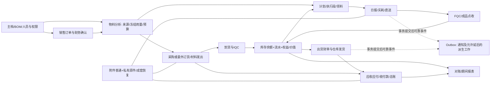

# R0 全平台现状复核

更新时间: 2026-09-30。状态: 已批准后的第一轮静态分类完成，调用链和运行复核继续进行。主方案见[07](07-整体优化统一方案-2026-09-30.md)，执行状态由[08](08-分阶段执行台账.md)维护，环境与恢复基线见[13](13-R0环境与恢复基线.md)。本文负责[10](10-历史239项复核台账.csv)、[11](11-跨模块能力覆盖矩阵.csv)、[12](12-历史评审补充复核台账.csv)的事实、分类与验证边界，不代替相应步骤的运行验收。

## 1. 本轮基线与分类规则

- 隔离工作区: `C:/Users/bruce/.codex/worktrees/platform-overhaul-20260930/uten_imp`。
- 源码基线: `d1bbfb7f467c7082f3ca9340a216a2ee4cf7b138`，分支 `uimp/platform-overhaul-r0-r1`。主目录中其他会话的未提交文件不属于本轮基线。
- 10保持239个唯一历史ID，12保持10条gap和9条质疑，不以合并根因删除历史行。对重复根因共同给证据，但逐条保留承接和结论。
- 分类仅用: 当前仍存、部分解决、已有修复待回归、旧结论不成立、需运行证实。静态结论增加“仅源码核验”，源码中有工具类、接口或测试文件不等于全调用链覆盖，也不等于测试通过。
- 旧报告的行数、数据库统计、部署状态和性能数字只作历史证据。本审计子任务没有进行业务数据库、生产服务或服务器操作。主线程独立完成的环境只读、隔离恢复与备份测试结果由13文档统一记载，不扩展成本审计的239项测试结果。
- CSV“复核中”表示正在完成R0事实核对，不表示整改已完成。未查完的项目仍为“待开始”，不能一键归为已修复。

## 2. 分批记录

### 第一轮覆盖结果

239条均保留原ID和历史优先级，当前分类为: 当前仍存49、部分解决86、已有修复待回归72、旧结论不成立7、需运行证实25。全部为当前基线的静态分类，**不是239项整改完成、不是72项测试通过**。旧P0/P1均有分类。具有相同根因的条目引用同一基础机制，但各自保留范围、承接步骤和运行边界。

12的10条gap与9条质疑已逐条初裁。11共15领域、13能力、195格，147格已补来源/当前能力或具体待验合同，48格仍未深入核验并明确保留“待核验”。已填写的格也不等于运行验证通过，不能据此把R0.03或R6.07标成已完成。

| 原维度 | 条数 | 当前仍存 | 部分解决 | 已有修复待回归 | 旧结论不成立 | 需运行证实 |
| --- | --- | --- | --- | --- | --- | --- |
| 前端性能 | 17 | 2 | 4 | 11 | 0 | 0 |
| 物料分析 | 17 | 4 | 6 | 5 | 0 | 2 |
| 生产执行 | 12 | 0 | 4 | 3 | 0 | 5 |
| 仓库品质 | 16 | 3 | 7 | 4 | 0 | 2 |
| 数据库结构 | 18 | 5 | 5 | 8 | 0 | 0 |
| 审计设置 | 13 | 1 | 4 | 6 | 1 | 1 |
| 权限 | 15 | 0 | 5 | 10 | 0 | 0 |
| 前端重复与拆分 | 25 | 7 | 15 | 2 | 0 | 1 |
| 文档 | 20 | 7 | 9 | 0 | 1 | 3 |
| 安全 | 19 | 1 | 0 | 17 | 1 | 0 |
| 死代码与文件 | 16 | 4 | 3 | 0 | 3 | 6 |
| 后端重复与拆分 | 25 | 11 | 11 | 1 | 1 | 1 |
| 正确性与稳定性 | 19 | 3 | 9 | 4 | 0 | 3 |
| critic新增 | 7 | 1 | 4 | 1 | 0 | 1 |

### 批次A: 旧P0/P1的已替代路径与公共基础

已核对前端徽章、会话能力和偏好快照、返回刷新、Web请求期限、转场、物料分析只读预览、履约预锁xmin/事务覆盖、TxSessionVars去重。相关CSV行登记当前符号和行号，运行验证暂未执行。具体边界:

- 已有徽章汇总不能重复建设；通知仍为20秒游标轮询，SSE是待评估扩展，不是证明旧高频问题仍存的依据。
- 物料分析仍有45秒详情轮询和大型共享State。当前路由检查、单飞、输入保护属于部分改善，不能据此认定浏览器后台、响应体、布局和审计成本全部通过。
- 下达预览采用只读overlay；后续必须对其执行只读SQL约束与真实下达结果等价回归。
- 预锁不再整行md5，但剩余锁范围、诊断重查、等待/重试预算与事务期间的来源变化仍需运行证明。
- `restoreAllMakeDelegations`仍被刷新路径调用，不可仅因旧报告写“死代码”而删除。近期权益、实收和反向链需要先给出完整使用证明。

## 3. 死信监控的最小后续实施建议

`BusinessOutboxFailureRecorder.java:18,30-40`在第8次失败将事件置为`status=2`。`ServerStatusProbe.java:369-395`只统计`business_outbox.status=0`，因此“没有待处理，但存在人工处理死信”可被显示成正常。现有`ServerStatusProbeTest.java:109-114`只覆盖数量/等待阈值。

最小变更是在原指标查询中独立读取`status=2`数量，原待处理数不改口径；详情明确区分待处理、死信、附件清理。任何死信至少进入WARNING，沿用现有状态告警链。当前表没有准确的死信发生时间，不应把`created_at`伪装成“进入死信多久”，首批可以只显示死信数量。补“待处理0且死信1不能NORMAL”、无死信原阈值不变、查询失败UNKNOWN三类回归。不得顺带自动重放或删除事件；业务恢复须另有权限、来源复核及幂等合同。

## 4. 当前优先承接与禁止误读

| 范围 | 现在能证明什么 | 下一步及边界 |
| --- | --- | --- |
| 日报完结与红冲 | `ProductionDailyReportService:1167/1318`仍拒绝跨多执行段订单行；已有target_events归属不等于该场景已支持 | R1.03/R3.01定义多段分摊和对称恢复，不能静默削减实产 |
| 写命令期限 | 配置数据库锁10秒/语句60秒/事务40秒；重试获新事务不等于共享整请求截止 | R1.01由主线程处理绝对截止和剩余期限，本表保存整改前基线并等待提交及回归回执 |
| 所见版本 | `OptimisticLocks:18-27`允许空值，但不少DTO/入口已强制版本 | R1.01按每个保存/审核/红冲/批操作列必填、校验、数据库CAS，不能宣称所有写端点存在漏洞 |
| 主仓锁与同步刷新 | `FulfillmentMutationLocks:276-278`协调锁仍在，SupplyWakeup仍逐分析同步refresh | R1.07缩小真实重复工作；实时权益/可用量不凭“异步更快”延后 |
| IQC结案空写 | `ProcurementIqcStockInService:1130-1146`逐订单行调用结案，`ProcurementOrderClosurePolicy:51-112`无差异谓词 | R1.06/R1.07在保留损耗/退换口径下按订单去重并只写真变化 |
| 审计销毁 | V671按总36个月默认期限直接DROP归档月分区；已有追加权限和成功事件 | R4补保全/外部归档恢复证据；13记载的公司归档为空仅说明当时无可见归档数据，不证明未来安全 |
| 附件与AI | 人工删附件直接排精确物理删除；孤儿另有双观察/72小时/批准；AI结果与任务短期清理 | R4区分原件、正式事实、可重建预览和技术临时数据，不把所有文件统一打包或删除 |
| 幂等留存 | business_outbox本行承担dedupe_key，成功行不是可随意丢弃的纯日志 | R4先分载荷与永久防重身份，再设清理期限；死信需可见且不得自动删/重放 |
| 数量与金额 | 当前余额、精确金额、BOM有效用量、报表工资折旧映射均已有实现 | R3做覆盖/等价/独立对账，不重新造余额、不把展示double直接等同财务错账 |
| MRP退役建议 | 当前`MrpService.PLANNING_WRITE_READY=true`，有受对象守卫保护的计划包入口 | 旧“写常量关闭所以整套死代码”前提不成立；R6.06先证明使用图和业务替代 |
| 认证与权限 | 会话、step-up、grant_policy、NULL归属拒绝、访客独立目录、询盘密钥强度与失败IP限流都已有 | 不按旧缺陷重建；对当前新增入口逐个HTTP负向验证，源码扫描误报需行为证明裁决 |
| 文档 | 准则索引157仍要求全表审计；待审收件台仍标在用；官网README把已存在schema/媒体账写未实现 | R6.06逐冲突修权威规则和反向链接，保留历史事故/失败事实 |

## 5. 文档与索引检查方法

本轮对全部ADR Markdown相对`.md`链接逐行取目标并检查存在性，发现6个缺目标候选，均集中在ADR-098的11/12/14行和ADR-101的10/18/240行。没有把外部网页不可访问当本地断链，也不把旧8条数字复用为当前结果。

对`lib/components`中`class Uten*`名称与组件总览做候选比对，得到46个名称未出现。里面包含内部控制器、模型和帮助类型，**不是46个公共组件必然漏文档**。R6.06须先按公共API筛选。已定位到的真实例子及候选路径写在10的docs-18中。

所有10引用的完整工作区文件路径已做存在性检查；Git命令输出、目录级证据、章节定位与“待运行”证据另列，不伪造文件行号。行号随后续实现会变化，后续验证按类/方法与候选SHA重新定位。

## 6. 11矩阵中的证据简称

11为了可读使用类名/历史ID简称；完整路径在10对应行或以下入口:

| 简称 | 当前源码入口 |
| --- | --- |
| 金额和资金账 | `server/src/main/java/com/uten/imp/common/finance/MoneyPolicy.java`、`common/util/FinancialExactAmount.java`、`features/finance/accountflow/AccountFlowLedgerService.java` |
| 版本和对象资格 | `server/src/main/java/com/uten/imp/common/concurrency/OptimisticLocks.java`、`security/DocumentAccessPolicy.java`、`common/web/StandardDocumentLifecycleCapabilities.java` |
| 主档引用 | `server/src/main/java/com/uten/imp/features/master/lifecycle/MasterReferenceCatalog.java`、`MasterReferenceGuard.java` |
| 日报/IQC | `server/src/main/java/com/uten/imp/features/production/dailyreport/ProductionDailyReportService.java`、`features/warehouse/inbound/ProcurementIqcStockInService.java` |
| 库存与对账 | `server/src/main/java/com/uten/imp/features/stock/StockService.java`、`StockBalanceRepository.java`、`StockReconciliationService.java` |
| 物料分析 | `server/src/main/java/com/uten/imp/features/production/analysis/MaterialAnalysisService.java`、`MaterialAnalysisCommandService.java`、`MaterialAnalysisSupplyWakeupService.java` |
| 权限/审计/设置 | `server/src/main/java/com/uten/imp/features/auth/AuthSessionService.java`、`features/rbac/GrantPolicy.java`、`audit/AuditService.java`、`features/admin/systemsetting/SystemSettingKey.java` |
| 附件/后台 | `server/src/main/java/com/uten/imp/features/attachment/AttachmentService.java`、`features/notice/outbox/BusinessOutboxPublisher.java`、`features/ai/job/AiJobHousekeeping.java` |
| 草稿/徽章 | `lib/shared/drafts/form_draft_mixin.dart`、`lib/shared/badges/badge_summary_provider.dart` |
| 官网/成套恢复 | `website/deploy/paired_state.py`、`website/deploy/website_release.py`、`deploy/postgres/backup/paired_internal_backup.py` |

## 7. 尚未完成

239项的初始分类已完成，但修复引入提交尚未逐项追溯，当前调用方覆盖、25项需运行证实、72项已有修复的本轮回归和11全部195格的真实验证仍按对应任务推进。第一轮留下的48格已在第8节补充源码入口追踪，未因此认定行为通过。不得因为CSV每行已填写就关闭R0/R6工程步骤。尤其不能把旧03预留迁移号/ADR号当作当前编号，也不能把旧“清Flyway历史”或“删除旧发布链”直接变成执行指令。

后续每条完成时补实际提交、受影响入口、运行命令/环境/结果、跳过原因和权限/反向/恢复证据；性能改动另外补同输入同资源前后对照。文档或纯结构检查可以有独立完成回执，但不能替代业务正确性和公司岗位验收。

## 8. 第二轮: 剩余48格的实际入口追踪

本轮继续读取Controller动作码、Service事务/来源/状态守卫、SQL更新条件、DTO能力和前端提交恢复路径，并补入11原来的48个空白能力格。**195格目前都已有源码入口或明确的待实现/待验证合同；没有一格因此自动获得“运行已验证”。** 只列出类名的第一轮线索，已在本轮补成关键方法和约束；其余更深调用方和运行验证仍按工作包进行。

新增证据的实际含义:

- 采购/委外编辑和反向: `PurchaseOrderService:478-576,701-707`、`SubcontractOrderService:539-589,1037-1043`均有独立动作权限和maker写范围；其detail DTO另按草稿/生产关联派生canEdit。找到这些守卫不证明所有报表、派生单据和批入口范围一致，L03/L04须真实HTTP逐个测试。
- 品质: `ProductionFqcInspectionService:546-574`要求决定权限和品质组织池，详情:541/1523另核报告读取范围；IQC使用独立VIEW/办理权限。普通、先入后检、逐行办理、passAll仍是四类输入合同。
- 财务主档: `AccountService:421-426`限制历史币种/金额字段和停用；`PaymentStyleService:288-293`直接拒绝删除并要求禁用保留历史。不能把覆盖货品等七类的MasterReferenceCatalog推广成所有金融主档都已覆盖。
- 真实表单恢复接线: 采购编辑:699-705、委外编辑:729-742、财务编辑:1160-1171、库存编辑:828-840都走创建提交、创建后checkpoint、完成草稿；FQC办理页:276/1023接FormDraftMixin并区分preserveInput。仍需创建已提交但响应丢失、附件失败、切身份和重启回归。
- 研发/建议: `RdTaskService.resolve:166-178`用状态+row_version条件更新并同事务发布关闭事件；`SuggestionService.reply:225-255`锁建议主行、仅允许前进状态，终态后的补回复不重复发送关闭回执。它们是业务状态事实，不是金额/库存流水。
- 访客: `VisitorHostConfirmService:75-101`锁申请并校验指定接待人，已批准/签到/拒绝/取消状态不能再确认；签到方法有悲观锁。源码只出现cancelled状态守卫不能证明取消命令已实现，本轮不声称已具备取消流程。
- 工资/报销: `PayrollService:324-405`依次锁批次并限制DRAFT→SUBMITTED→APPROVED→PUBLISHED，发布行数必须等headcount；`ExpenseClaimService:681-696`仅本人DRAFT且无未删除附件时硬删草稿。正式工资、审批和票据的保留合同不可套草稿规则。
- 官网: `website/app/admin/actions.ts:178-179,478-507,627-641,926-936`有后台会话及发布/未发布删除资格；`website/lib/upload-storage.ts:117-204`先fsync发布、精确hash删除。官网表单不使用ERP的FormDraftMixin，不能以ERP草稿测试代表CMS未保存内容恢复。

### 8.1 新发现 N-R0-01: 询盘转客户并发已复现并局部修复

`WebsiteInquiryService.convert:121-142`先普通`require(id)`，检查converted/clientId后调用`WebsiteInquiryClientAdapter.createFromInquiry:31-57`创建新客户。询盘实体及BaseEntity/AuditableEntity未声明`@Version`，该查询未使用FOR UPDATE；adapter的sourceId只进入remark，没有用它查重已有客户。V253的source_id唯一约束只保护**询盘行**，不证明两次并发转客户只创建一个客户。

以上为初查的基线代码证据。随后真实PG红基线11项中7失败、2数据库异常，实际复现两个客户、状态覆盖、旧JPA快照与员工/询盘锁序问题。候选按员工→询盘固定锁序，锁后刷新实体及重验状态；sourceId首次投递使用来源级事务锁，回放不覆盖原始快照。11项真实PG及5项相关单测共16项通过、零跳过，4文件已按SHA集成到根。仍不是全HTTP、全部交接业务或公司验收，见[询盘记录](../2026-09-30-官网询盘转换并发与来源回执修复.md)。归W01/R1.01和W16/R6.02；未按客户名称合并。N-R0-01为本轮新增项，不改变历史239项分母。

### 8.2 新发现 N-R0-02：AI终态保留起算及清理保护

`AiJobRepository.deleteFinishedOlderThan`按创建日删除终态行，会把长期排队后刚结束的任务、本轮刚被判失败的任务过早清掉，并可能越过配置更长的结果保留期。旧9个真PG场景6断言失败、1删除锁等待超时、2项原保护通过。候选从可信结束日起算，保留尚有结果/学习重试及日期矛盾行；一条SQL锁定最多1000个候选并跳过忙行。

独立复核追加“结束早于创建”的历史异常，先前候选1红后修复；最终10项新保留测试、11项原AI队列、6项学习回执共27项真PG通过。局部修复已保存本地`ad413b02`，未运行业务库清理或公司部署。详见[AI保留记录](../2026-09-30-AI任务保留起算与有界清理.md)。归W17/R4.04；新增项不改变历史239项分母，整个清理策略/原件保留/后台公平性仍未完成。

## 9. 简短依赖图与事务边界

箭头表示依赖和来源，不表示把整条销售到收款放进一个事务。每个命令内部的状态、来源占用、真实库存/权益、资金/价值事实与其回执必须原子；通知及明确允许重建的派生工作才可提交后处理。反向命令必须沿原始来源精确恢复。生产两种批出库是整批原子，销售/委外/其它出库保留逐单原子与首错停止；主档批生命周期是单事务处理并返回逐项资格结果，获准项提交，受阻项返回原因；BOM粘贴是另一种整批原子合同。

## 10. 12条主链的当前验收合同

沿用05的12条主链编号，纠正旧固定部门数、旧迁移头、无条件“设置立即生效”和把所有批量当同一种原子操作的表达。以下为**待执行合同**，不报告已通过。每条均需普通岗位身份、负向身份、输入/权威响应/持久事实/列表徽章、重试与反向证据；只查一个Service不能替代整链。

| 编号 | 实际主链与事实源 | 正向/事务验收 | 反向、并发、权限与恢复 |
| --- | --- | --- | --- |
| L01 | 销售保存→SalesOrderFinanceConfirm→有效预留/缺口 | 主档与条款快照完整，金额由服务端派生；财务确认版本与编辑所见一致；订单单位和基本单位换算守恒 | 修改后旧审批失效；重复/断连不重建；撤审/减少订单恢复预留；他人UUID及无财审权拒绝 |
| L02 | MaterialAnalysisService/Command→采购/委外/车间三桶 | 供应方式自动保存，缺失规则阻断；预览只读且与真实办理等价；父子追加保留来源，BOM采用冻结有效用量 | 同分析两人填数/刷新/提交、取消/借调/公共份归还；新事实合并不吞本地输入；权限变化不显示可执行假动作 |
| L03 | 请购→采购订货→财审→到货→IQC→入库/应付 | 分拆来源守恒，普通与先入后检分合同；合格/不合格/部分入库不重算另一份权威金额；库存、权益与应付对应同来源 | 超到退回、退换/贷项、全退对应应付冲平；版本冲突及20单边界回滚；采购/仓储/品质/财务分别办理 |
| L04 | 委外申请→订货→精确子件发料→回厂→IQC→入库 | 两条来源路线、允许损耗、短交/自带料/前置自制分合同；实际发回与对应权益、重量、成本关联 | 发料与回厂反向精确镜像；正常损耗不改原订货量，索赔另账；批次首错保留已成功且回执可恢复 |
| L05 | 计划执行→普通/内料仓领料→日报实耗/直送→FQC→成品点收 | 原计划责任、实产公共份、实物耗用分账；直送1/3/11块和混合去向；先入后检FQC不能复用普通路径假设 | 多段封顶/红冲目前有限制，不能把拒绝当最终支持；退料、补产、作废、同键重放与提交断连不损来源/数量/价值 |
| L06 | 出货单→财审→仓库拣货出库→应收/销售退货 | view/approve/reject/reverse/execute分权；分批金额累计分摊等于原单；财审快照与本次拣货来源一致 | 三类出库逐单原子合同保留；失败不重复前成功；退货/冲销恢复原币本币、库存、预留、价值；重放可查 |
| L07 | 收付款/转账/费用/收入/余额调整→GL；报销/资产/工资并入来源核对 | 余额与流水同事务，借贷平衡；工资/折旧报表读取真实来源且未配置明确；报销票据与审批快照、工资发布人数匹配 | 收付核销/抵销/原币本币尾差、关账/反结账、折旧摊销重建、报销驳回重提与付款红冲；敏感金额/人员范围负向 |
| L08 | 权限目录→全员基础/部门/个人/委派/数据范围→页面动作 | 按全部现存部门而非旧11部门核对；无变化保存零写、变更一条差异事件；hub=可达子卡，allowedActions与后台资格一致 | 撤权立刻阻断写/导出，空归属不公开、系统池显式授权；代操作归属保留，批量不绕过敏感码策略 |
| L09 | 登录/refresh/服务端session→step-up→账号支持/访客流程 | 锁定对错同码、哈希资源有界、临时凭据期限、高危目标发凭据门禁；访客只能按允许关键词找接待人 | 登出/锁定/离职/改密吊销，step-up过期/重复核销失败；访客接待人确认、HR审核、签到不得越权/重复，拒绝和拉黑保留步骤 |
| L10 | 请求语义/显式事件/数据库三清单→审计查询与留存 | 人工写/允许的敏感读按现行AuditRequestContext/AuditDetailViewRecorder分类，不一律审所有GET；actor/onBehalfOf/requestId可串联 | 无变化不产噪音；运行角色不能改删审计；冻结/归档/销毁需回执与恢复证据，过期不直接抹业务证明；错误脱敏 |
| L11 | 主档/分类/BOM/人员变化→引用目录/专属守卫→所有业务读取 | 七类MasterCatalog和账户/科目/币种等专属守卫分别验证；BOM粘贴原子；主档批命令每项给版本/权限/引用结果 | 并发引用与删除/停用互斥；历史名称/单位/编号身份保留；离职移交和重新学习不改变既有业务快照 |
| L12 | 系统设置登记→保存/审计→实际消费者→生效状态 | 每键明确即时/下一轮/重启或外部调度模式，不能只断言表值；前后端界限一致，部署秘密不变普通业务设置 | 并发保存、非法边界、配置失败/回滚、切身份缓存；badgePollSeconds等实际消费者验证；密码长度退役不反向恢复 |

12主链外的当前扩展也必须纳入验收: E01研发关闭/建议匿名和终态/询盘转客户(N-R0-01)；E02普通与私有附件、AI导入学习证据、过期清理；E03官网CMS匿名发布投影/媒体账/后台权限；E04旧库引导、新建库、现库升级、成套备份和中断恢复。L07并入工资/资产/报销不表示它们仅需各测一条成功路径。

## 11. 135项仍存/部分项去重后的实施工作包

49项仍存与86项部分解决保持原239行不删除，按**主要修改责任**一对一分到下面22个工作包。相同公共根因只实施一次，关联业务链分别验收。10新增“当前工作包”列；72项已有修复待回归、7项旧结论和25项需运行证实不被混入135项实施分母，仍按其原承接步骤闭环。

优先级表示工程先后，不等于认定现场存在对应等级安全事故。W01/W05/W17已有主线程局部候选，其余未标实施完成；每个包可按业务链切更小提交，禁止一次改完所有模块再验收。跨包依赖: W22先建立核对底线；W01/W02/W03的合同约束W05/W06；W08/W09贯穿所有写入口；W17恢复/保全通过后才允许R5归档；W21重基线依赖全部现役合同及恢复证明。W10-W16负责结构和操作一致性，不能被压缩为性能专项。

| 包 | 优先级 | 目标 | 08承接 | 修改边界 | 所需验证(均待执行) | 主要承接历史ID |
| --- | --- | --- | --- | --- | --- | --- |
| W01 | P1 | 命令身份、所见版本、幂等和结果未知 | R1.01 / R1.05 | 公共命令门面、DTO/Controller必填、操作键、事务截止；先日报/五类出库再财务/采购/询盘 | 真HTTP+PG:同键同结果、异内容拒绝、并发双击、重试余时、COMMIT超时/断连结果核对；保持各批语义 | correctness-stability-06、correctness-stability-07、correctness-stability-17、dup-backend-split-11、overhaul-gap-01 |
| W02 | P1 | 数量、来源、预留和状态统一 | R3.01 / R3.03 / R1.03 | SalesChain/Reservation/BOM用量/日报CAP及反向；先明确定义与单写属主，不先删镜像列 | 基本/订单单位守恒、公共/订单份额隔离、跨段封顶/红冲、重学冻结边、乱序/并发预留；独立SQL对账 | correctness-stability-03、correctness-stability-05、correctness-stability-09、correctness-stability-18、dup-backend-split-03、dup-backend-split-05、dup-backend-split-06 |
| W03 | P1 | 精确金额、会计来源和报表合同 | R3.02 / R3.06 | 金额字符串DTO、金融展示、GL期间/实时来源模板、工资/折旧绑定 | 大金额与极小分摊、原币本币、末批取余、退款抵销、科目改名、关账/反结账；借贷及账表核对 | correctness-stability-12、correctness-stability-19、dup-backend-split-13 |
| W04 | P2 | 库存价值实现减负与模型边界 | R1.07 / R3.02 | InventoryValueLedger/Position/Work，先批读批写和未变不写；模型变更另有决策 | 采购待检/入库/耗料/退回价值来源、待定成本补齐、跨期调整、重放不重计；图可追溯与余额守恒 | perf-warehouse-quality-04、db-schema-17 |
| W05 | P1 | 生产与仓库写入上下文和提交工作量 | R1.02-R1.04 / R1.06-R1.07 | 日报直送/FQC自动点收/IQC/StockDoc批上下文、锁序、结案去重、V674后触发器；不可恢复已撤回合单 | 现有预算+真实PG并发锁、整批回滚/逐项成功、混合来源重量/成本/权益、提交阶段触发器和前后业务快照 | perf-production-exec-01、perf-production-exec-02、perf-warehouse-quality-02、perf-warehouse-quality-03、perf-warehouse-quality-05、perf-warehouse-quality-06、perf-warehouse-quality-07、perf-warehouse-quality-09、perf-warehouse-quality-12、perf-warehouse-quality-15、db-schema-05、db-schema-06 |
| W06 | P1 | 物料分析变化集、版本和办理原子组 | R1.07 / R3.01 / R3.04 | CommandService/Service/RootSupply/SupplyWakeup，按当前聚合办理合同冻结变化集；动态权益不跨计划缓存 | 只读预览与写入等价、无变化版本/更新数、多组混合来源、父子追加、失败回滚、即时可用量与反向唤醒 | perf-material-analysis-03、perf-material-analysis-04、perf-material-analysis-06、perf-material-analysis-07、perf-material-analysis-08、perf-material-analysis-09、perf-material-analysis-10、perf-material-analysis-12、perf-material-analysis-14 |
| W07 | P2 | 业务读投影、名称和期间汇总 | R2.01-R2.02 / R3.04-R3.05 | Workbench先页后算、详情展示快照、MV脏期间/影子重建；保持权限/历史口径 | 列表=徽章=事实，深分页/排序无漏重，补记/红冲/乱序提交重算期间，真实EXPLAIN与影子差异零 | perf-production-exec-03、perf-frontend-05、db-schema-12 |
| W08 | P1 | 对象权限、动作能力和敏感数据边界 | R6.02 / R2.01 | Controller/Service范围、allowedActions、permission surface、敏感加密及参数日志；不把null版本帮助类当全域漏洞 | 多岗位他人UUID/空归属/代操作/撤权/批量负向；动作显隐=服务端资格；参数与日志脱敏不打印密钥 | security-14、permissions-05、permissions-06、permissions-10、permissions-12、permissions-15、dup-frontend-split-16 |
| W09 | P1 | 审计、设置生效和错误追踪 | R6.03 / R2.05 | 审计动作目录/请求号到UI、SystemSettingKey全部消费者、badgePollSeconds生效；部署参数仍受控 | 同动作一条语义事件、模拟身份、无变化无审计、设置保存-真实生效、错误头/日志关联、失败配置不假成功 | audit-retention-settings-03、audit-retention-settings-10、audit-retention-settings-12、overhaul-gap-07 |
| W10 | P2 | 统一操作反馈、详情动作和恢复交互 | R2.05 / R2.07 | 原因/确认框生命周期、DocAction执行器、财审骨架、全局异步错误、编辑初始化/创建checkpoint | 弹框退场dispose、取消/403/409/5xx/未知结果、busy互斥、草稿不丢、屏幕阅读/字号/键盘，禁止吞错误 | correctness-stability-16、dup-frontend-split-02、dup-frontend-split-04、dup-frontend-split-07、dup-frontend-split-09、dup-frontend-split-11、dup-frontend-split-12 |
| W11 | P2 | 表格、分页、格式与状态公共内核 | R2.04 / R2.07 / R3.02 | MasterDataTable/EditableGrid共用布局筛选/分页、精确格式和模型读取；动态列与草稿行身份保留 | 虚拟化焦点/选择/编辑/异步行更新、单位合计、排序筛选导出一致、重复缺失字段失败不归零 | dup-frontend-split-08、dup-frontend-split-10、dup-frontend-split-15、dup-frontend-split-20、dup-frontend-split-24、perf-frontend-16、dup-frontend-split-01 |
| W12 | P2 | 物料分析前端职责和增量响应 | R2.03 / R2.07 | 共享State按候选/树/办理/输入/预览拆模块，小预览DTO和投影diff；保留实际来源服务器权威 | 快速改数/清空/取消/切后台/多窗口、服务端新事实与本地输入合并、主线程长任务/响应量、无前端提交真源 | perf-frontend-10、perf-frontend-11、perf-frontend-12、dup-frontend-split-13、dup-frontend-split-19、dup-frontend-split-23、dup-backend-split-25、overhaul-gap-05 |
| W13 | P2 | 后端领域职责、端口和数据映射 | R6.01 / R3.06 | 通知/分析/库存/销委/日报按query-command-policy-port拆；原生SQL表属主、具名record、代理事务检查 | 拆前后同输入同业务事实；真实代理事务/rollback-only/flush，跨域只经批准端口；不以减少行数验收 | dup-backend-split-01、dup-backend-split-07、dup-backend-split-08、dup-backend-split-09、dup-backend-split-12、dup-backend-split-15、dup-backend-split-16、dup-backend-split-17、dup-backend-split-18、dup-backend-split-19、dup-backend-split-20、dup-backend-split-21、dup-backend-split-22、dup-backend-split-23、dup-backend-split-24 |
| W14 | P2 | 前端模块依赖、选择器与构建边界 | R2.07 / R6.06 | 路由/Repository/模型按模块、共享选择器/树/表格下沉，按需拆包与带版本资源 | 全部深链/返回/权限可达、不同选择器列与范围、旧标签更新/冷启构建、公共层无反向feature依赖 | dup-frontend-split-06、dup-frontend-split-21、dup-frontend-split-22、dup-frontend-split-25、perf-frontend-17 |
| W15 | P2 | 采购委外共享办理与表结构评估 | R2.07 / R6.01 / R6.05 | 先差异表与共享表单/命令策略，后评估合表；委外材料/损耗/回厂独有合同不抹平 | 采购/委外全链对照、单张批量同规则、真实外键/旧库导入等价、数据迁移与回退演练；合表可裁定不做 | dup-frontend-split-05、dup-frontend-split-14、dup-backend-split-10、overhaul-gap-04 |
| W16 | P2 | 编号、引用目录与重复基础表 | R6.02 / R6.05 | 双编号终身预留、计数表/HR认领引用统一；先查DataHandover/导入/审计/退役测量表 | 并发取号永不重用、迁移前后编号成员等价、交接任务引用完整、主档删除/停用与历史数据不丢 | db-schema-07、db-schema-16 |
| W17 | P1 | 保留、死信、防重证据与可恢复销毁 | R4.01-R4.07 / R5.01-R5.04 | 审计分区/Outbox载荷与防重身份、会话AI、普通与私有附件回收；V761仅死信可见性候选 | 冻结阻断销毁、归档包hash/恢复查询/原件下载、重放仍防重、死信>0告警、断电/磁盘满/撤权/引用变动 | db-schema-10、db-schema-11、audit-retention-settings-06、audit-retention-settings-08 |
| W18 | P2 | 兼容、失效入口和部署链清理 | R6.06 / R1.01 | 按使用图退役兼容分支/旧资产入口/旧发布链/工具包，先版本握手与导入恢复依赖；不删当前true的MRP | 旧标签安全升级/草稿保护、旧schema只读迁移边界、release/backup调用图、无失联入口和运行材料误删 | perf-material-analysis-16、perf-warehouse-quality-16、dead-code-files-03、dead-code-files-06、dead-code-files-07、dead-code-files-15、dead-code-files-16、correctness-stability-11、overhaul-gap-06 |
| W19 | P2 | 后台唤醒和资源配额 | R1.08 / R6.03 | ReadinessReconciler按脏维度/游标/持久任务资格改造；分离前台请求和后台重试容量 | 缺料不变无重复重计算、到货不漏唤醒、重启恢复、公平处理、后台负载下前台可用；非业务事实异步化 | perf-production-exec-07 |
| W20 | P2 | 规范、现状、证据与链接收口 | R6.06 / R6.04 | 修全表审计旧准则/退役页面/官网NO-GO/目录职责，保留历史事故和失败记录；公共组件登记筛真API | 相对链接/ADR取代/页面路由/权限码/组件目录检查，规则对照现码，历史性能标明候选与不适用边界 | docs-01、docs-02、docs-03、docs-04、docs-07、docs-08、docs-09、docs-11、docs-12、docs-14、docs-15、docs-16、docs-17、docs-18、docs-19、docs-20、dead-code-files-13 |
| W21 | P2 | 最终结构、旧库引导和迁移策略 | R6.05 / R7.05 | 旧库全量bootstrap/手写fixture/最终catalog；基线压缩只在等价恢复证明后单独执行 | 空库建库=旧链schema+种子、现库升级不损数据、来源/数量/金额/引用对账、备份实际恢复；不改已应用SQL | db-schema-04、db-schema-18、dead-code-files-08 |
| W22 | P1 | 跨模块不变量和12主链验收 | R3.03 / R7.02 / R6.08 | 独立事实查询与各模块持久账对账，逐场景结束终检；与W01/W02/W03并行建立安全网 | 余额=流水、预留/计划/执行分摊、质量/实物/价值、ARAP/GL/资金、权限/审计/回放和反向全链 | correctness-stability-10 |

### 11.1 候选V761的独立记录

在初轮基线d1bbfb7f之外，主线程工作树已新增候选`V761__business_outbox_dead_letter_visibility_index.sql`，当前源码迁移目录为V761/688。只读核对发现:

- `ServerStatusProbe:376-400`独立计数status=2，以待处理+死信作为未解决总数；任意死信至少WARNING，原最老时间仅描述待处理等待。
- V761仅创建`business_outbox(id) WHERE status=2`部分索引，不重放/删除事件或改状态。
- 尚无本记录中的运行/落库/告警/安装验收，10/12保持“复核中”。该候选只处理W17的可见性一小步，不解决所有Outbox保留/防重瘦身和统一管理界面。
- 后续需验证零待处理但有死信、阈值边界、查询失败UNKNOWN、真实SQL索引和迁移可应用，以及通知告警链，之后另记候选SHA与测试回执。
